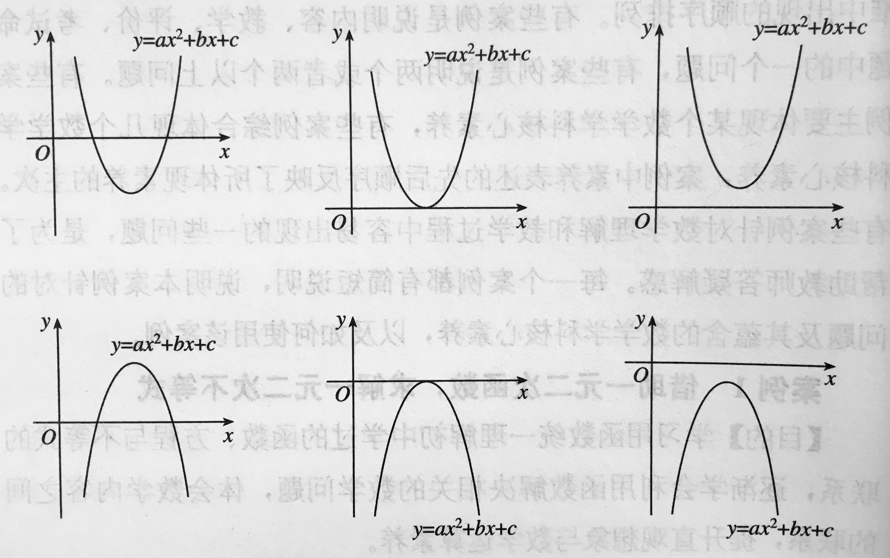
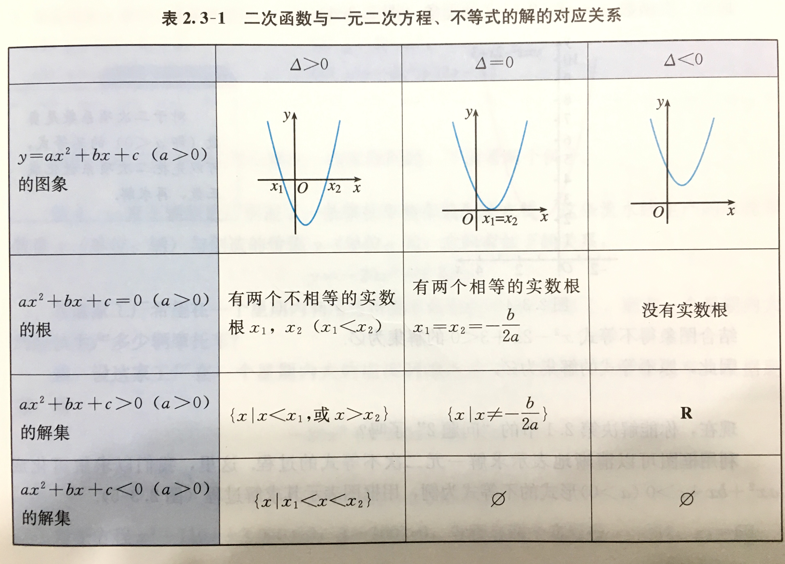

#### 从函数观点看一元二次方程和一元二次不等式
> **课标内容**：用函数理解方程和不等式是数学的基本思想方法。帮助学生用一元二次函数认识一元二次方程和一元二次不等式，理解函数、方程和不等式之间的联系，体会数学的整体性。内容包括：（1）从函数观点看一元二次方程：会结合一元二次函数的图象，判断一元二次方程实根的存在性即实根的个数，了解函数的零点与方程根的关系。（2）从函数观点看一元二次不等式：经历从实际情境中抽象出一元二次不等式的过程，了解一元二次不等式的现实意义。能借助一元二次函数求解一元二次不等式，并能用集合表示一元二次不等式的解集。借助一元二次函数的图象，了解一元二次不等式与相应函数、方程的联系。

##### 从函数观点看一元二次方程
一般地，一元二次$\color{blue}{方程 }ax^2+bx+c=0\ (a\neq0)\color{blue}{ 的根}$ 就是二次函数 $y=ax^2+bx+c\ (a\neq0)$ 当函数值取零时自变量 $x$ 的值，即二次函数 $y=ax^2+bx+c\ (a\neq0)$ 的图象与 $x$ 轴交点的横坐标，也称为$\color{blue}{二次函数 }y=ax^2+bx+c\ (a\neq0)\color{blue}{ 的零点}$。

##### 从函数观点看一元二次不等式
【情境】基于不等式 $ax^2+bx+c>0\ (a\neq0)$，给出相应函数图象，分析求解的程序。

【分析】求解一元二次不等式通常有两种基本方法。一种是代数方法，先对二次三项式进行因式分解，把一元二次不等式转化为一元一次不等式组，通过求解一元一次不等式组，得到一元二次不等式的解集；另一种是函数方法，借助一元二次函数图象的直观，得到求解一元二次不等式的通性通法。后者是一种程序思想的方法，具体分析如下：对于一元二次不等式 $ax^2+bx+c>0\ (a\neq0)$，根据系数的不同，一元二次函数 $y=ax^2+bx+c\ (a\neq0)$ 的图象与 $x$ 轴的位置关系可以分为如下六类。用函数方法求解的程序为：通过系数 $a$ 的符号，判定函数图象开口方向；通过一元二次方程 $ax^2+bx+c=0\ (a\neq0)$ 根的判别式 $\Delta=b^2-4ac$，判定函数图象与 $x$ 轴的位置关系；通过计算方程的根得到不等式的解集。

```{r function-inequality_1, echo=FALSE, fig.cap="", out.width = '80%'}

```

```{r function-inequality_2, echo=FALSE, fig.cap="", out.width = '80%'}

```

---

练习：国家为了加强对引用酒生产的宏观管理，实行征收附加税政策。已知某种酒每瓶70元，不征收附加税时，每年大约销售100万瓶；若政府征收附加税，每销售100元要征收R元（叫做税率R%），则每年的销售量将减少10R万瓶。要使每年在此项经营中所收取的附加税不少于112万元，R应怎样确定？

练习：汽车在行驶中，由于惯性的作用，刹车后还要继续向前滑行一段距离才能停住，我们称这段距离为“刹车距离”。刹车距离是分析事故产生原因的一个重要因素。在一个限速为40km/h的弯道上，甲、乙两辆汽车相向而行，发现情况不对，同时刹车，但还是相碰了。事后现场勘察测得甲车的刹车距离小于12m，乙车的刹车距离略超过10m。又知甲、乙两种车型的刹车距离 $s$（单位：m）与车速 $x$（单位：km/h）之间分别有如下关系：$s_{\text{甲}}=0.1x+0.01x^2$，$s_{\text{乙}}=0.05x+0.005x^2$。问：甲、乙两车有无超速现象？

练习：据气象部门预报，在距离某码头南偏东 $45^{\circ}$ 方向600km处的热带风暴中心正以20km/h的速度向正北方向移动，距风暴中心450km以内的地区都将受到影响。据以上预报估计，从现在起多长时间后，该码头将受到热带风暴的影响，影响时间大约多长（精确到0.1h）？

练习：设 $m$ 为实数，若函数 $y=x^2-mx+2$ 有且只有一个零点，求 $m$ 的值。

练习：设 $k$ 为实数，若方程 $4(x^2-3x)+k-3=0$ 没有实数根，求 $k$ 的取值范围。

练习：证明：函数 $y=5x^2-7x-1$ 的一个零点在区间 $(-1,0)$ 内，另一个零点在区间 $(1,2)$ 内。

练习：设 $m$ 为实数，已知二次函数 $y=x^2-5x+m$ 的两个零点都在区间 $(1,+\infty)$ 内，求 $m$ 的取值范围。

练习：（1）$k$ 是什么实数时，方程 $x^2+2(k-1)x+3k^2-11=0$ 有两个不相等的实数根？（2）已知不等式 $x^2-2x+k^2-1>0$ 对一切实数 $x$ 恒成立，求实数 $k$ 的取值范围。

练习：已知不等式 $ax^2+bx-1>0$ 的解集是 $\{x\vert 3<x<4\}$，求实数 $a,b$ 的值。